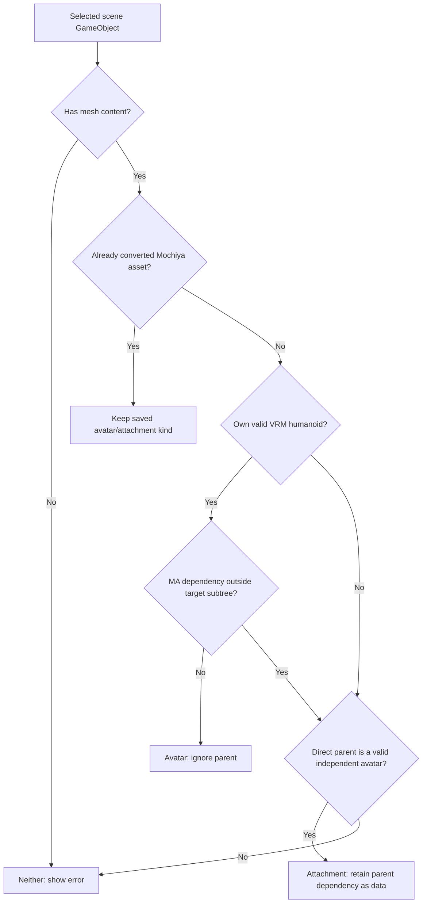

[Getting started](../README.md) | [Documentation index](index.md)

# Avatar Tools guide

## Your first conversion or export

See [asset preparation](upload.md#prepare-your-asset) for scene setup and selecting a whole avatar or a separate attachment.

1. Place your avatar or attachment prefab in a scene. If an attachment depends on a base avatar, keep it directly under that avatar with its original MA setup intact.
2. Open **Mochiya → Avatar Tools** and assign **Avatar or attachment**.
3. Check **Detected asset** and its explanation. Resolve any errors; expand **Compatibility warnings (optional)** to review unsupported behavior.
4. Review **Export settings (optional)** above the action buttons, then choose **Convert to VRM GameObject** to keep an editable scene duplicate, or **Export VRM / GLB…** to save a model file.

Choose **VRM** for supported humanoid, expression and spring-bone behavior. Choose **GLB** for general glTF use; ordinary GLB does not carry the VRM runtime behavior. The separate **Mochiya → Export GLB or VRM with lilToon…** window also supports ordinary props as GLB.

You do not need to move the model to the scene origin. Export normalizes a temporary copy; scene conversion places the duplicate at the reference avatar's position and rotation.

### Export settings

The bundled profile works without entering metadata for every export. It uses the object's name, version `1.0`, author **Mochiya VRM Exporter**, sparse morph targets and no mesh freezing. Review the metadata before distributing your model.

Under **Export settings (optional)**, select a profile or choose **Create editable copy**. You can also use **Assets → Create → Mochiya → Export Profile**. Profiles contain metadata and native UniVRM/UniGLTF options. Enable **Use Attached Vrm Metadata** to reuse metadata from an existing VRM.

## Working with attachments

A parent alone does not make a target an attachment. The deciding factor is **dependency**:

Attachments include clothing, accessories, hair and other assets that depend on a base avatar. Conversion has two kinds: Avatar and Attachment. The upload form separately offers an Accessory marketplace category.

- **Avatar:** its own humanoid can be exported as VRM, and its MA setup has no dependency outside the selected subtree.
- **Attachment:** it needs its direct parent's humanoid, or MA components inside it reference/change the parent, its other descendants, or avatar settings. The direct parent must be a valid independent avatar.
- **Neither:** neither rule can be satisfied, or required authoring references are broken.

External dependencies include MA armature targets, Bone Proxies, blendshape sync/changes, object/material changes and avatar controller/settings references. Internal references do not create a parent dependency. An attachment with its own humanoid keeps it. Otherwise, conversion uses the attachment as the root and completes its existing armature with missing parent-reference humanoid bones. Matching authored bones keep their transforms, skin bindings and extra physics branches; there is no parallel reference armature or extra attachment wrapper. Parent and sibling meshes are excluded. An attachment without an owned rig receives the required reference bones.

Humanoid completion uses MA root targets and prefix/suffix settings, or unambiguous skin/hierarchy/name matching. Missing ancestors are inserted while preserving world poses. UniVRM's name-deduplication utility preserves mapped humanoid names first and renames conflicting objects in the duplicate; composition aliases retain original names. The resulting humanoid is rebuilt and validated; ambiguous mappings or incompatible hierarchies produce an error. External colliders retain their reference pose through explicit anchors when the garment has a different bone offset. This preparation is separate from MA baking: the exported component records still instruct Avatar Composition how the attachment follows a base.

The humanoid check uses the root Animator's valid Humanoid Avatar, required unique bone mappings and contained skin bones. An incomplete rig or a VRM/VRC component alone does not qualify. Broken MA references produce an error before classification. Prepared assets still undergo export validation.

Mochiya records supported MA instructions for web composition; it does not run MA baking. Selecting a whole avatar retains its included attachment rigs separately. Use Modular Avatar first when you need a Unity-side merge, or export the base and attachments separately for web composition.

## Export a Unity animation as VRMA

**VRMA** is the file extension for **VRM Animation**, a format for playing humanoid motion on compatible avatars in Mochiya Avatar Studio and other supporting apps. A single-frame AnimationClip stores a pose; a multi-frame clip can store motion.

1. Open **Mochiya → Avatar Tools** and find **Export animation**.
2. Assign a **Humanoid AnimationClip** to **Animation Clip**.
3. Choose **Export VRM Animation (.vrma)…** and save the `.vrma` file.

The exporter uses a built-in, upright humanoid reference skeleton. It samples the clip at 30 Hz including its endpoint, or writes one sample for a static pose. Evaluated hips position and rotation are preserved; no scene avatar is modified. You can cancel sampling before the file is written. In Mochiya Avatar Studio, add the exported file through the animation controls and select it for playback.

This exports humanoid bone motion, including fingers, for compatible VRMA players. Generic/Legacy clips, object or blendshape curves, facial expressions, Animator controllers, constraints, events and runtime IK are not exported. Use a standalone Humanoid-only clip. Different avatar proportions can change foot contact and hand placement; VRMA retargeting does not guarantee an identical pose on every avatar. Export profiles for VRM/GLB models do not affect animation export.

