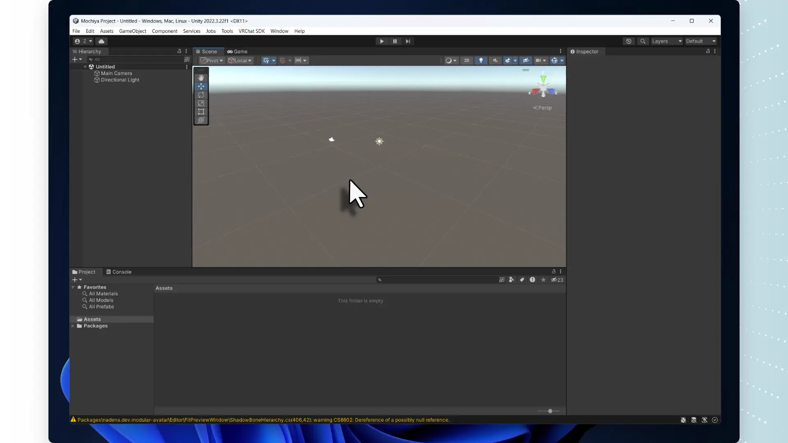
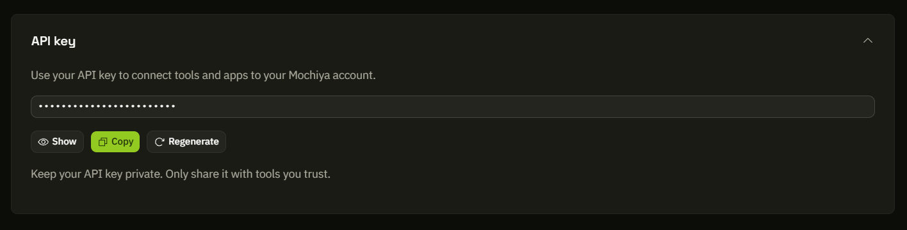
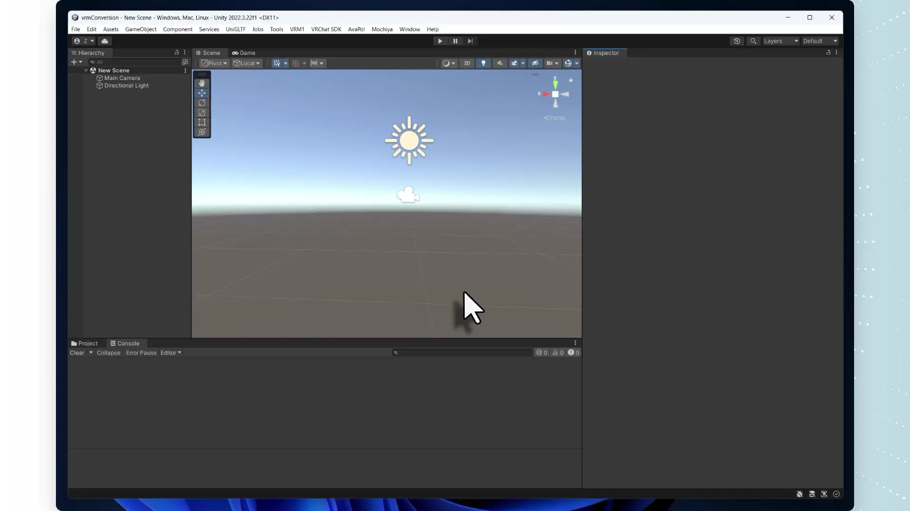

[**English**](README.md) | [**日本語**](README.ja.md) | [**简体中文**](README.zh-CN.md) | [**한국어**](README.ko.md)

# Mochiya Avatar Tools

Unityのアバター・衣装・アクセサリーを[Mochiya](https://www.mochiya.org/ja)で共有したり、対応アプリ向けのファイルとしてエクスポートしたりできます。**Upload to Mochiya**を使えば、作品を自分のAvatar Studio用ライブラリに追加したり、マーケットプレイスに出品したりできます。元のシーンオブジェクトは変更しません。

## インストール

**Unity 2022.3以降**と[Git](https://git-scm.com/downloads)が必要です。VRChat SDK Avatars、Modular Avatar、lilToon（2.3.4以降）など、モデルが使用するパッケージもインポートしてください。

**Window > Package Manager > + > Add package from git URL**を開き、以下のURLを**上から順に1つずつ**追加します。各インストールの完了を待ってから次へ進んでください。



1. UniGLTF：
   ```text
   https://github.com/vrm-c/UniVRM.git?path=/Packages/UniGLTF#v0.131.2
   ```
2. UniVRM：
   ```text
   https://github.com/vrm-c/UniVRM.git?path=/Packages/VRM10#v0.131.2
   ```
3. Mochiya Avatar Tools：
   ```text
   https://github.com/mochiya-labs/unity-avatar-tools.git
   ```

UniVRM/UniGLTF 0.131.2以降がすでに導入されている場合は、互換性のある既存の環境をそのまま使用できます。コンパイルが完了すると、**Mochiya**メニューが表示されます。[その他のインストール方法（英語）](Documentation~/installation.md)。

## Mochiyaへのアップロード用に接続する

**APIキーが必要なのはUpload to Mochiyaを使う場合だけです。** パソコン上で変換・エクスポートする場合は、[Mochiya Avatar Tools](#local-avatar-tools)へ進んでください。アカウントもAPIキーも不要です。

1. [Mochiya](https://www.mochiya.org/profile)にログインし、プロフィールを開きます。アカウントがない場合は作成してください。
2. プロフィール下部の**APIキー**を開き、キーをコピーします。このキーで、Unityのツールから自分のMochiyaアカウントへアップロードできます。
3. Unityで**Mochiya > Upload to Mochiya**を開き、言語を**日本語**にします。**APIキー**欄にキーを貼り付けて**接続**を押し、接続が成功してからアップロードしてください。キーは他人に共有しないでください。





## Mochiyaにアップロード

**編集モード**で、モデルのプレハブを**Project**からシーンの**Hierarchy**へドラッグします。アップロードしたいものに合わせて、次のオブジェクトを選んでください。

- **アバター全体：** アバターのルートオブジェクトをドラッグします。その中にある衣装やアクセサリーも含まれます。
- **衣装・髪・アクセサリーだけ：** 制作者の説明に従い、対応するアバターにセットアップします。元のModular Avatarコンポーネントを残したままアバターのルート直下に配置し、衣装などのルートだけをドラッグします。事前にMA Manual Bakeは実行しないでください。

```text
Hierarchy
└── My avatar      ← 全体をアップロードする場合はこちらをドラッグ
    ├── Body
    ├── Armature
    └── My outfit  ← 衣装だけの場合はこちらをドラッグ
```

衣装などを単体でアップロードする場合、ベースアバターのスケルトンを参照しますが、ベースの身体や他の衣装は含まれません。ベースアバターを先にアップロードする必要はありません。アイテムの利用要件には対応アバターとバージョンを記載してください。別の体型に合わせて衣装が自動調整されるわけではありません。

1. **Upload to Mochiya**で、**Hierarchy**からモデルを**アバターまたはアタッチメント**欄へドラッグします。タイトルを確認し、カテゴリとカバー画像を選び、**個人利用**または**マーケットプレイスに掲載**を選択します。必要に応じて**追加のアイテム情報**からギャラリー画像や購入者向けファイルを追加します。有料販売にはWebサイトでの販売者設定が必要です。
2. エラーを解消し、**個人利用としてアップロード**または**出品を公開**を押します。モデルは自動でエクスポートされます。完了後は**アイテムを見る**で確認できます。既存アイテムの編集はWebサイトで行います。


[ファイル制限・接続・アップロードの再開（英語）](Documentation~/upload.md) · [互換性と制限（英語）](Documentation~/reference.md#supported-behavior-and-limits)

<a id="local-avatar-tools"></a>

## Mochiya Avatar Tools

モデルをファイルとして保存・共有したい場合や、別のアプリで使いたい場合は、**Mochiya > Avatar Tools**を開きます。このパネルでは、対応アプリで使えるVRMまたはGLB形式でモデルを保存できます。エクスポート前に確認・調整したい場合は、Unityシーン内に編集可能なVRMのコピーを作成することもできます。

動きやポーズを保存する場合は、同じパネルでHumanoidのAnimationClipを**VRM Animation（.vrma）**としてエクスポートできます。Mochiya Avatar Studioや対応アプリで、対応するアバターにアニメーションを適用できます。1フレームのクリップはポーズを保存します。

変換・エクスポートはパソコン上で行われるため、MochiyaアカウントやAPIキーは不要です。モデルをMochiyaにアップロードしたいだけなら、**Upload to Mochiya**がモデルのエクスポートも行います。

[変換・アニメーションガイド（英語）](Documentation~/avatar-tools.md) · [詳細ドキュメント（英語）](Documentation~/index.md) · [MITライセンス](LICENSE)
