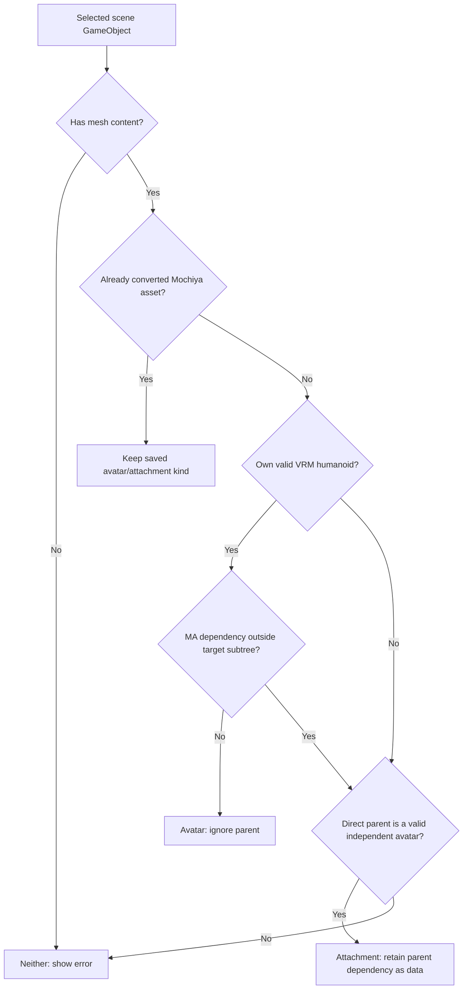

# Mochiya Avatar Tools

Convert Unity avatars and attachments into VRM 1.0 or GLB for [Mochiya](https://mochiya.org)'s web tools. Supported VRChat and Modular Avatar (MA) settings become standard VRM components and portable Mochiya data. Supported lilToon materials keep their settings and textures.

**Mochiya converts assets; Modular Avatar merges them in Unity.** Conversion preserves separate armatures, skin bindings and poses. It works on a duplicate and leaves the original setup unchanged.

## Install

Use **Unity 2022.3+** and **UniVRM/UniGLTF 0.131.2+**. Add these entries to the existing `dependencies` object in your project's `Packages/manifest.json`:

```json
"com.vrmc.gltf": "https://github.com/vrm-c/UniVRM.git?path=/Packages/UniGLTF#v0.131.2",
"com.vrmc.vrm": "https://github.com/vrm-c/UniVRM.git?path=/Packages/VRM10#v0.131.2",
"org.mochiya.avatar-tools": "https://github.com/zekailin00/liltoon-unity-exporter.git"
```

This example pins the verified UniVRM version. For a local copy, use **Window → Package Manager → Add package from disk** and select this package's `package.json`.

The package ID is `org.mochiya.avatar-tools`. Existing Mochiya components and export profiles retain their script GUIDs when the package is updated.

Install **VRChat SDK Avatars**, **Modular Avatar** and **lilToon 2.3.4+** only when your source assets use them. They are optional integrations. Missing scripts or shaders on an asset still need repairing.

## Use the Unity window

1. Place your prefab in a scene. Keep an unbaked attachment directly under its reference avatar when it needs that avatar.
2. Open **Mochiya → Avatar Tools** and assign **Avatar or attachment**.
3. Read **Detected asset** and its reason. Invalid input shows an error. Expand **Compatibility warnings (optional)** to inspect omissions; acceptance is never required.
4. Choose **Convert to VRM GameObject** for an editable scene duplicate without writing files, or **Export VRM / GLB…** to write a file directly. Direct export removes its temporary conversion.

Selecting a complete avatar includes its existing children with their armatures still separate. Mochiya does not run MA Merge Armature, reparent Bone Proxies, or apply attachment snapping. For a Unity-side merge, use [Modular Avatar](https://modular-avatar.nadena.dev/docs/reference/merge-armature) before converting. For portable web composition, export attachments separately from their unbaked setup.

**No metadata entry is required.** The default profile uses the object's name, version `1.0`, the single author **Mochiya VRM Exporter**, sparse morph targets, and no mesh freezing. Under **Export settings (optional)**, select a profile or create an editable copy. **Assets → Create → Mochiya → Export Profile** creates additional profiles. They contain metadata and native UniVRM/UniGLTF settings; enable **Use Attached Vrm Metadata** to reuse an existing VRM's metadata.

**Mochiya → Export GLB or VRM with lilToon…** accepts the same profiles and also exports ordinary props as GLB.

## Avatar or attachment?

A parent alone does not make a target an attachment. The deciding factor is **dependency**:

Attachments include clothing, accessories, hair and other assets that depend on a base avatar. There is no separate Accessory category.

- **Avatar:** its own humanoid can be exported as VRM, and its MA setup has no dependency outside the selected subtree.
- **Attachment:** it needs its direct parent's humanoid, or MA components inside it reference/change the parent, its other descendants, or avatar settings. The direct parent must be a valid independent avatar.
- **Neither:** neither rule can be satisfied, or required authoring references are broken.

External dependencies include MA armature targets, Bone Proxies, blendshape sync/changes, object/material changes and avatar controller/settings references. Internal references do not create a parent dependency. An attachment with its own humanoid keeps it. Otherwise, conversion copies the required parent reference skeleton/context without parent or sibling meshes; the attachment bones remain separate.



The humanoid check uses the root Animator's valid Humanoid Avatar, required unique bone mappings and contained skin bones. An incomplete rig or a VRM/VRC component alone does not qualify. Broken MA references produce an error before classification. Prepared assets still undergo export validation.

## Use from a script

Put this in an Editor script. `selected` is a scene GameObject, `path` ends in `.vrm` or `.glb`, and `profile` is an optional export profile.

```csharp
using Mochiya.AvatarTools.Editor;

var detected = MochiyaAvatarWorkflow.Detect(selected);
var report = MochiyaAvatarWorkflow.Validate(selected);
if (!report.CanConvert)
    throw new System.InvalidOperationException(string.Join("\n", report.Errors));

// Direct conversion, export and temporary-object cleanup:
var exportReport = MochiyaAvatarWorkflow.Export(selected, path, profile);

// Or keep an editable duplicate in the scene:
var converted = MochiyaAvatarWorkflow.ConvertToVrmGameObject(selected, profile);
MochiyaLilToonExporter.ExportWithProfile(converted.Root, path, profile);
```

Omit the profile argument or pass `null` for the bundled default. Reports contain errors, warnings and unsupported features. The explicit `ConvertAvatarInScene` and `ConvertAttachmentInScene` APIs enforce the same classification rules. Dispose a conversion result only to remove its duplicate. Use `MochiyaLilToonExporter.ExportGlb(prop, path)` for a general model without a humanoid.

## Architecture and web playback

| Package | Responsibility |
| --- | --- |
| Modular Avatar | Authors attachment relationships and performs Unity-side merges when requested. |
| Mochiya Avatar Tools | Converts the selected asset, records supported MA intent, and adds Mochiya extensions during export. |
| UniVRM / UniGLTF | Provides standard VRM components, geometry/material conversion and VRM/GLB file writing. |
| `@pixiv/three-vrm` | Loads and updates standard VRM humanoids, expressions and spring bones in the browser. |
| `three-liltoon` | Renders materials carrying `MOCHIYA_materials_liltoon`. |
| `@mochiya/avatar-composition` | Reads `MOCHIYA_avatar_composition`, fits separate attachments by names, applies supported actions and restores the base on removal. |

The host enables rendering with `enableLilToon(renderer)` and registers `enableLilToonVRM(new VRMLoaderPlugin(parser))` plus `MochiyaAvatarCompositionLoaderPlugin` on one Three.js `GLTFLoader`. After loading, it prepares assets and attaches attachments through `AvatarCompositionSession`. Each frame: call `beforeVrmUpdate()`, update the base animation/VRM once, then call `afterVrmUpdate(delta)`. Its `examples/viewer` demonstrates local-file loading, fitting, controls and removal.

Both Mochiya extensions are optional additions to standard files. Ordinary viewers display standalone geometry and fallback materials without attachment actions. Matching uses bone, armature, mesh and blendshape names; missing names warn and skip only affected operations. It does not check base identity or reshape garments to fit different bodies.

Both converted avatars and attachments carry `MOCHIYA_avatar_composition`, with `assetKind: "avatar"` or `"attachment"`. New attachment exports use `rig.role: "attachmentReference"`. The current composition draft stores MA-style component instructions; re-convert older prepared objects and re-export older files to use it.

## Supported behavior and limits

**VRM** means `VRMC_vrm` unless another extension is named; **Mochiya** means `MOCHIYA_avatar_composition`.

| Output feature | Converted from | Main limitation |
| --- | --- | --- |
| VRM expressions | VRC visemes/eyelids; existing VRM expressions | VRC conversion covers five vowels and blink only. |
| VRM look-at | VRC eye rotations/View Position; existing VRM look-at | VRC eye ranges are approximated. |
| VRM first-person | Existing VRM settings or generated defaults | VRC-specific visibility is not translated. |
| Spring bones and colliders (`VRMC_springBone`) | VRC PhysBones/colliders; existing VRM physics | Approximate active-preset simulation and sphere/capsule collisions; no VRC interactions or angle limits. |
| Node constraints (`VRMC_node_constraint`) | Existing UniVRM constraints | No VRC constraint conversion. |
| Mochiya `mergeArmature` | MA Merge Armature; generated reference rig | Roots/settings are retained; web matching is unidirectional. Other lock modes warn and fall back. No Unity merge. |
| Mochiya `boneProxy` | MA Bone Proxy; external base-collider anchors | Keep World Pose or At Root in the web runtime; partial-pose/scale modes warn and keep world pose. |
| Mochiya `blendshapeSync` | MA Blendshape Sync | Grouped bindings with MA linear remap points; no synchronization chains or cycles. |
| Mochiya `shapeChanger` | MA Shape Changer | Preserves Set/Delete and distance threshold (`0.01` by default). The web runtime reversibly removes affected triangles. Exported morph frames or baked scale can change selection; export warns. Unavailable runtime geometry falls back to weight 0 with a warning. |
| Mochiya `objectToggle` | MA Object Toggle | Grouped visibility entries; no cyclic visibility rules. |
| Mochiya `materialSetter` | MA Material Setter | Grouped whole-material slot replacements. |
| Mochiya `menuItem` | MA Toggle/Button menu items | Automatic object activation and local parameter metadata; buttons are momentary. No Animator execution/networking/menu hierarchy. |
| lilToon materials (`MOCHIYA_materials_liltoon`) | Regular opaque/cutout/transparent lilToon, including outlines | No specialized variants; 2D textures/UV0 only. Browser appearance can differ. |

Component records preserve source roots, settings, conditions and grouped entries; resolved bone pairs are computed by the web runtime. The `@mochiya/avatar-composition` specification defines the wire format and runtime rules. Each VRM retains its own spring/collider groups; cross-asset collider linking is outside this profile.

Other VRC/MA behavior, including Animator programs, Contacts and mesh processing, is omitted. Ordinary GLB omits VRM behavior. Texture export requires graphics-enabled Unity.

MIT-licensed; see [LICENSE](LICENSE). UniVRM/UniGLTF (VRM Consortium) and lilToon (lilxyzw) are separate MIT-licensed projects whose source is not redistributed here. Models and textures retain their own licenses.
