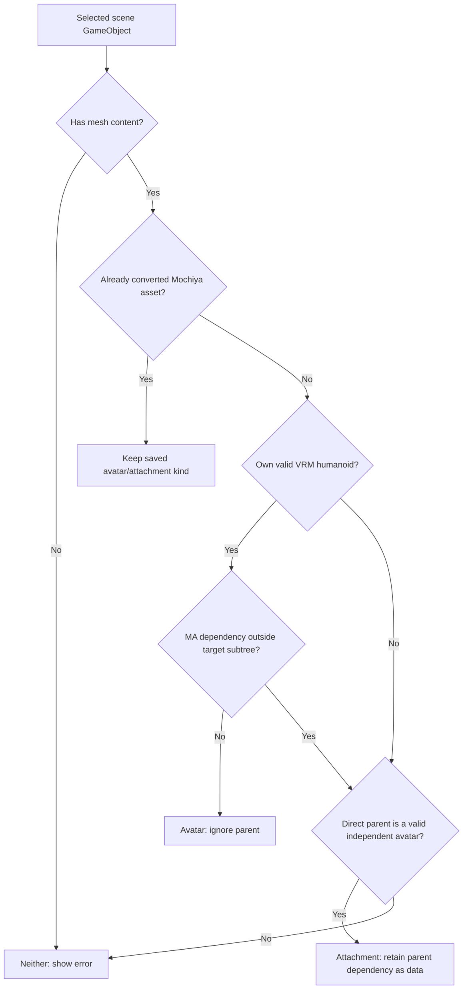

# Mochiya Avatar Tools

Prepare Unity avatars, outfits and accessories for [Mochiya](https://www.mochiya.org) and compatible web viewers. Mochiya Avatar Tools converts supported VRChat and Modular Avatar setups into **VRM 1.0 or GLB**, preserves supported lilToon materials, and can upload items directly from the Unity Editor.

Conversion works on a duplicate and leaves your original setup unchanged. Offline conversion and export do not require a Mochiya account.

## What you can do

- Convert an avatar or attachment into an editable VRM GameObject.
- Export a VRM or GLB without creating a permanent scene duplicate.
- Preserve supported expressions, physics and attachment instructions for web playback.
- Upload a model, cover, gallery and additional buyer files directly to Mochiya.
- Reuse export profiles for metadata and native UniVRM/UniGLTF settings.

## Start here

[Install the package](#installation) → [Prepare your asset](#prepare-your-asset) → [Upload to Mochiya](#upload-directly-to-mochiya) → [Check the result](#check-and-manage-your-item).

For local files only, see [conversion and export](#your-first-conversion-or-export). If something goes wrong, see [troubleshooting](#troubleshooting). The later sections cover detailed compatibility and optional scripting; you do not need to read code to upload an item.

## Installation

Use **Unity 2022.3 or newer**, with **UniVRM/UniGLTF 0.131.2 or newer**. For an existing avatar project, keep the Unity version supported by that asset and its other packages. Save your scene and back up the project before installing or updating packages.

### Install through Unity's Package Manager

1. Open the Unity project containing your asset.
2. Install [Git](https://git-scm.com/downloads) if it is not already available, then restart Unity and Unity Hub. Unity uses Git to download these packages; you do not need to run Git commands.
3. Open **Window → Package Manager** (in Unity 6, **Window → Package Management → Package Manager**).
4. Click **+**, then **Add package from git URL…** (called **Install package from git URL…** in newer Editors). Paste the first URL below and click **Add/Install**. Wait for installation to finish, then repeat for the next URL, in order.

| Order | Package | URL to paste |
| --- | --- | --- |
| 1 | UniGLTF | `https://github.com/vrm-c/UniVRM.git?path=/Packages/UniGLTF#v0.131.2` |
| 2 | UniVRM 1.0 | `https://github.com/vrm-c/UniVRM.git?path=/Packages/VRM10#v0.131.2` |
| 3 | Mochiya Avatar Tools | `https://github.com/mochiya-labs/unity-avatar-tools.git` |

These URLs select a specific supported UniVRM version. If compatible UniGLTF and UniVRM 1.0 packages are already installed, keep them and skip their installation steps. Avoid mixing an older copy imported into `Assets` with another copy installed through Package Manager; follow [UniVRM's installation guidance](https://vrm.dev/en/univrm/install/univrm_install/) when replacing an existing installation.

Wait for Unity to finish importing and compiling. Installation is ready when **Mochiya → Upload to Mochiya** and **Mochiya → Avatar Tools** appear in the top menu and the Console has no red compilation errors. See [Unity's Git installation instructions](https://docs.unity3d.com/2022.3/Documentation/Manual/upm-ui-giturl.html) if Package Manager cannot download a package.

Install **VRChat SDK Avatars**, **Modular Avatar (MA)** and **lilToon 2.3.4 or newer** when your source asset uses them, following the asset creator's setup instructions. They are optional integrations for Mochiya, but missing scripts or shaders on your asset must be repaired before conversion.

<details>
<summary>Alternative installation: manifest or downloaded package</summary>

Add these entries to the existing `dependencies` object in `Packages/manifest.json`. Preserve its other entries and valid JSON commas; do not replace the whole file.

```json
"com.vrmc.gltf": "https://github.com/vrm-c/UniVRM.git?path=/Packages/UniGLTF#v0.131.2",
"com.vrmc.vrm": "https://github.com/vrm-c/UniVRM.git?path=/Packages/VRM10#v0.131.2",
"org.mochiya.avatar-tools": "https://github.com/mochiya-labs/unity-avatar-tools.git"
```

For a downloaded Mochiya repository ZIP, extract it to a permanent folder outside your project's `Assets` folder. In Package Manager, choose **Add/Install package from disk…** and select its `package.json`. Install the UniVRM dependencies above as well. Keep the extracted folder in place while the project uses it.

</details>

## Prepare your asset

Work in **Edit Mode**: Unity's Play button should be off. Drag the asset's prefab from the **Project** panel into the scene's **Hierarchy** panel, then select its top-level object in the Hierarchy.

- **Whole avatar:** select the avatar root. Clothing and accessories already inside that root are included in the uploaded model.
- **Separate outfit, hair or accessory:** configure it on its intended base avatar using the asset creator's instructions. Keep the attachment directly beneath the avatar root, with its original MA components intact. Select only the attachment root for upload. Do not run MA Manual Bake before this workflow.

For example, this outfit is a direct child of its base avatar:

```text
Hierarchy
└── My avatar
    ├── Body
    ├── Armature
    └── My outfit  ← select this to upload only the outfit
```

The base avatar supplies the attachment's reference rig; its body and sibling meshes are excluded from a separate attachment export. You do not need to upload the base first. Tell users which base avatar and version the attachment was made for: Mochiya does not automatically reshape clothing to fit every body.

Have a PNG or JPEG cover image ready. If you want buyers to receive a Unity package, source files or instructions, prepare those files separately—the upload does not automatically package your Unity project. Include only content you have permission to upload or distribute.

## Upload directly to Mochiya

You can upload straight from the original scene object; a separate conversion or manual model export is unnecessary. The upload panel supports English, Japanese, Simplified Chinese and Korean through **Language**. The labels below use English.

### Connect your account

1. Sign in to [Mochiya](https://www.mochiya.org), then open your [profile](https://www.mochiya.org/profile).
2. Expand **API key** below the profile tabs and copy the key.
3. In Unity, open **Mochiya → Upload to Mochiya**, paste it into **API key**, and click **Connect**.
4. Check **Connected as** to confirm the correct account.

### Complete the item and upload

1. Drag the prepared scene object from the Hierarchy into **Avatar or attachment**, or select it in the Hierarchy and click **Use selection**. Selecting a source fills the title with its object name; edit the title afterward.
2. Review the detection message and expand **Compatibility warnings**. Resolve errors before uploading. Warnings describe behavior that may be approximated or omitted.
3. Keep **Model format: VRM** for supported avatar expressions and spring physics. Choose **GLB** when you need general glTF geometry; ordinary GLB does not carry VRM behavior. The tool generates this model file for you.
4. Complete the fields below. For a first check, keep **Availability: Personal use**.
5. Click **Upload for personal use**, or **Publish listing** for a marketplace item. Keep Unity open while it prepares the model, uploads files and finishes the upload.
6. Wait for **Your item is ready.**, then click **View item**. Reaching the file-transfer stage alone does not mean the item has finished publishing.

| Field | What to enter |
| --- | --- |
| Title (required) | A clear item name, up to 80 characters. Selecting another source replaces it. |
| Category (required) | Avatar body, Outfit, Hair, Accessory or Other. This is the marketplace category, separate from automatic avatar/attachment detection. |
| Tags (optional) | Add one tag at a time with **Add**; up to 12 distinct tags, 40 characters each. |
| Availability | **Personal use** keeps it in your library for Avatar Studio. **Listed on marketplace** lets others acquire it for free or buy it. You can change this later on the website. |
| Item price (marketplace only) | USD `0` for free, or $0.50–$900,000 for paid items. Paid prices must cover the displayed fees. |
| Cover image (required) | Choose one PNG/JPEG showing the item. It is not captured automatically from Unity. |
| Export settings (optional) | Select a reusable export profile to customize model metadata and export options. See [export settings](#export-settings). |
| Additional item details (optional) | Expand this section for gallery images, additional downloadable files, specifications, requirements, credits and license terms. |

**Paid listings:** open your profile's **Seller information**, submit the seller application and bank destination, and wait for Mochiya approval before listing a paid item. Review the panel's **Payment processing fee**, **Mochiya fee** and **Estimated earnings** for the current deductions.

In **Additional item details**, describe supported avatars/versions and setup steps under **Requirements & setup**, and state what is included under **Specifications**. Add appropriate credits and license terms. These listing terms are separate from the metadata embedded in the VRM file; review both before distribution.

| File or text | Limit |
| --- | --- |
| Required cover and optional gallery | PNG/JPEG, 10 MiB per image; up to 12 gallery images |
| Generated model | One VRM/GLB, 500 MiB maximum |
| Additional downloadable files | Up to 20 files, 500 MiB each |
| All uploaded files combined | 2 GiB maximum, including images and the generated model |
| Specifications / Requirements & setup | 5,000 / 4,000 characters |
| Credits / License terms | 2,000 / 3,000 characters |

Additional downloadable files are only the files you explicitly select. The generated model is used for Mochiya's 3D preview and editor; it does not replace an installable Unity source package for buyers.

### Check and manage your item

Open **View item** and check the cover, details and 3D preview. Then open [Avatar Studio](https://www.mochiya.org/studio) with your uploaded item. For an attachment, test it with its intended base avatar. Check appearance, fit, available controls and motion: a successful upload and a Unity preview do not guarantee identical browser rendering.

Find your uploads in your profile's **Uploaded items** tab. Edit an existing item's details, files, price or availability on the website. The Unity panel creates new items; uploading again after a successful upload creates a separate item. To list an item you tested for personal use, edit that existing item on the website.

### Retry or cancel an upload

**Retry upload** keeps the current upload and skips files already received; an interrupted file starts again from the beginning. **Cancel** stops the current transfer without signing out. **Prepare a new upload**, or changing the form, starts fresh preparation. Unfinished sessions expire after 24 hours and are cleaned up by the service.

After an Editor reload and automatic connection check, retry to recover a completed upload or finalize files that already arrived. If some files are missing and local preparation state was lost, the panel asks you to prepare a new upload. If the final result is uncertain, check **Uploaded items** before starting another upload. Signing out clears local recovery information. Temporary exports are removed after completion or cleanup; source objects remain unchanged.

### Remembered sign-in

After a successful connection, your sign-in is remembered for this Unity project on this computer using your OS credential store. Reopening the panel, reloading scripts or restarting Unity checks the saved key before enabling uploads. **Disconnect** signs out and removes it. Failed connection checks (including a server outage) and API authentication/server/network failures clear the saved sign-in; ordinary item-validation or file-transfer errors keep it.

The key is not stored in project files or shared when you copy the project. Moving the project to another path requires connecting again. Windows uses Credential Manager; macOS uses Keychain; Linux requires `secret-tool` and an available Secret Service keyring. If access is denied, unlock your credential store and reconnect.

Keep the key private. If it is exposed, use **Regenerate** in your Mochiya profile, then connect again with the new key in each Unity project that uses it.

## Troubleshooting

| Problem | What to do |
| --- | --- |
| Package Manager cannot find Git | Install Git, restart Unity and Unity Hub, and retry. On Windows, Git must be available on PATH; see the linked Unity installation guide. |
| No Mochiya menu, or red compilation errors | Wait for compilation, then open **Window → General → Console**. Resolve the first red error. Check that both required UniVRM packages are installed and that older duplicate copies are not present. |
| Missing scripts or pink materials | Restore the asset's required SDK, MA or shader packages using its creator's instructions before exporting. |
| “Place the prefab in a scene” or no meshes detected | Drag the prefab into the Hierarchy and select its model root, rather than the Project-panel prefab or an empty container. |
| Invalid humanoid or parent dependency | For an attachment, use its intended valid base avatar as the direct parent and retain the original MA setup. For a whole avatar, check its Humanoid rig and source setup. Conversion cannot repair an arbitrary broken rig. |
| Upload button is disabled | Connect and wait for **Connected as**. Confirm the account, network connection and access to your OS credential store. |
| Asked to update Avatar Tools | Update the package, allow Unity to compile, and reconnect. The installed upload form must be compatible with Mochiya's current service. |
| Paid listing rejected | Check seller approval in your profile and ensure the price covers the displayed fees. Use $0 only if you intend a free listing. |
| File or text limit error | Check the table above, including the generated model and total size. Remove unneeded files or reduce image/model size in your source workflow, then prepare again. |
| Network error or interrupted upload | Restore the connection, reconnect if signed out, and use **Retry upload** when available. Check your profile before starting a new upload if completion was uncertain. |
| Too many uploads | Wait an hour before creating another upload. Use an existing retry when available. |
| Clothing, materials or physics look different in Mochiya | Test the intended base, review compatibility warnings and the limits below. Arbitrary VRChat animation logic and exact Unity shader/physics parity are not supported. |

For Git installations, select **Mochiya Avatar Tools** in Package Manager and click **Update**. See [Unity's package update instructions](https://docs.unity3d.com/2022.3/Documentation/Manual/upm-ui-update.html) for revision-specific installation alternatives. Back up first and test the updated project before replacing a working setup. For disk installations, replace the extracted package with the updated download while preserving its location, then let Unity reimport it.

If you still need help, [open an issue](https://github.com/mochiya-labs/unity-avatar-tools/issues) with your Unity/package versions, operating system, exact error text and steps to reproduce it. Remove API keys, personal details and private asset files from screenshots or logs; share a minimal reproduction only when you can redistribute it.

## Your first conversion or export

1. Place your avatar or attachment prefab in a scene. If an attachment depends on a base avatar, keep it directly under that avatar with its original MA setup intact.
2. Open **Mochiya → Avatar Tools** and assign **Avatar or attachment**.
3. Check **Detected asset** and its explanation. Resolve any errors; expand **Compatibility warnings (optional)** to review unsupported behavior.
4. Choose **Convert to VRM GameObject** to keep an editable scene duplicate, or **Export VRM / GLB…** to save a model file.

Choose **VRM** for supported humanoid, expression and spring-bone behavior. Choose **GLB** for general glTF use; ordinary GLB does not carry the VRM runtime behavior. The separate **Mochiya → Export GLB or VRM with lilToon…** window also supports ordinary props as GLB.

You do not need to move the model to the scene origin. Export normalizes a temporary copy; scene conversion places the duplicate at the reference avatar's position and rotation.

### Export settings

The bundled profile works without entering metadata for every export. It uses the object's name, version `1.0`, author **Mochiya VRM Exporter**, sparse morph targets and no mesh freezing. Review the metadata before distributing your model.

Under **Export settings (optional)**, select a profile or choose **Create editable copy**. You can also use **Assets → Create → Mochiya → Export Profile**. Profiles contain metadata and native UniVRM/UniGLTF options. Enable **Use Attached Vrm Metadata** to reuse metadata from an existing VRM.

## Working with attachments

A parent alone does not make a target an attachment. The deciding factor is **dependency**:

Attachments include clothing, accessories, hair and other assets that depend on a base avatar. Conversion has two kinds: Avatar and Attachment. The upload form separately offers an Accessory marketplace category.

- **Avatar:** its own humanoid can be exported as VRM, and its MA setup has no dependency outside the selected subtree.
- **Attachment:** it needs its direct parent's humanoid, or MA components inside it reference/change the parent, its other descendants, or avatar settings. The direct parent must be a valid independent avatar.
- **Neither:** neither rule can be satisfied, or required authoring references are broken.

External dependencies include MA armature targets, Bone Proxies, blendshape sync/changes, object/material changes and avatar controller/settings references. Internal references do not create a parent dependency. An attachment with its own humanoid keeps it. Otherwise, conversion uses the attachment as the root and completes its existing armature with missing parent-reference humanoid bones. Matching authored bones keep their transforms, skin bindings and extra physics branches; there is no parallel reference armature or extra attachment wrapper. Parent and sibling meshes are excluded. An attachment without an owned rig receives the required reference bones.

Humanoid completion uses MA root targets and prefix/suffix settings, or unambiguous skin/hierarchy/name matching. Missing ancestors are inserted while preserving world poses. UniVRM's name-deduplication utility preserves mapped humanoid names first and renames conflicting objects in the duplicate; composition aliases retain original names. The resulting humanoid is rebuilt and validated; ambiguous mappings or incompatible hierarchies produce an error. External colliders retain their reference pose through explicit anchors when the garment has a different bone offset. This preparation is separate from MA baking: the exported component records still instruct Avatar Composition how the attachment follows a base.


```mermaid
flowchart TD
    A[Selected scene GameObject] --> B{Has mesh content?}
    B -- No --> X[Neither: show error]
    B -- Yes --> P{Already converted Mochiya asset?}
    P -- Yes --> K[Keep saved avatar/attachment kind]
    P -- No --> C{Own valid VRM humanoid?}
    C -- Yes --> D{MA dependency outside target subtree?}
    D -- No --> V[Avatar: ignore parent]
    D -- Yes --> E{Direct parent is a valid independent avatar?}
    C -- No --> E
    E -- Yes --> O[Attachment: retain parent dependency as data]
    E -- No --> X
```

The humanoid check uses the root Animator's valid Humanoid Avatar, required unique bone mappings and contained skin bones. An incomplete rig or a VRM/VRC component alone does not qualify. Broken MA references produce an error before classification. Prepared assets still undergo export validation.

Mochiya records supported MA instructions for web composition; it does not run MA baking. Selecting a whole avatar retains its included attachment rigs separately. Use Modular Avatar first when you need a Unity-side merge, or export the base and attachments separately for web composition.

## Supported behavior and limits

**VRM** means `VRMC_vrm` unless another extension is named; **Mochiya** means `MOCHIYA_avatar_composition`.

| Output feature | Converted from | Main limitation |
| --- | --- | --- |
| VRM expressions | VRC visemes/eyelids; existing VRM expressions | VRC conversion covers five vowels and blink only. |
| VRM look-at | VRC eye rotations/View Position; existing VRM look-at | VRC eye ranges are approximated. |
| VRM first-person | Existing VRM settings or generated defaults | VRC-specific visibility is not translated. |
| Spring bones and colliders (`VRMC_springBone`) | VRC PhysBones/colliders; existing VRM physics | Approximate active-preset simulation and sphere/capsule collisions; no VRC interactions or angle limits. |
| Node constraints (`VRMC_node_constraint`) | Existing UniVRM constraints | No VRC constraint conversion. |
| Mochiya `mergeArmature` | MA Merge Armature; generated reference rig | Roots/settings are retained; web matching is unidirectional. Other lock modes warn and fall back. No Unity merge. |
| Mochiya `boneProxy` | MA Bone Proxy; external base-collider anchors | Keep World Pose or At Root in the web runtime; partial-pose/scale modes warn and keep world pose. |
| Mochiya `blendshapeSync` | MA Blendshape Sync | Grouped bindings with MA linear remap points; no synchronization chains or cycles. |
| Mochiya `shapeChanger` | MA Shape Changer | Preserves Set/Delete and distance threshold (`0.01` by default). The web runtime reversibly removes affected triangles. Exported morph frames or baked scale can change selection; export warns. Unavailable runtime geometry falls back to weight 0 with a warning. |
| Mochiya `objectToggle` | MA Object Toggle | Grouped visibility entries; no cyclic visibility rules. |
| Mochiya `materialSetter` | MA Material Setter | Grouped whole-material slot replacements. |
| Mochiya `menuItem` | MA Toggle/Button menu items | Automatic object activation and local parameter metadata; buttons are momentary. No Animator execution/networking/menu hierarchy. |
| lilToon materials (`MOCHIYA_materials_liltoon`) | All nine regular rendering modes; Normal/OnePass/TwoPass transparency and outlines | Extension 1.2 requires an updated runtime. Additional-light passes and Unity shadow parity remain deferred. 2D textures/UV0 only; dense animated fur has CPU cost in WebGL2. Lite, Multi, FurOnly and tessellation remain unsupported. |

Component records preserve source roots, settings, conditions and grouped entries; resolved bone pairs are computed by the web runtime. The `@mochiya/avatar-composition` specification defines the wire format and runtime rules. Each VRM retains its own spring/collider groups; cross-asset collider linking is outside this profile.

Other VRC/MA behavior, including Animator programs, Contacts and mesh processing, is omitted. Ordinary GLB omits VRM behavior. Texture export requires graphics-enabled Unity.

## Use from a script

Put this in an Editor script. `selected` is a scene GameObject, `path` ends in `.vrm` or `.glb`, and `profile` is an optional export profile.

```csharp
using Mochiya.AvatarTools.Editor;

var detected = MochiyaAvatarWorkflow.Detect(selected);
var report = MochiyaAvatarWorkflow.Validate(selected);
if (!report.CanConvert)
    throw new System.InvalidOperationException(string.Join("\n", report.Errors));

// Direct conversion, export and temporary-object cleanup:
var exportReport = MochiyaAvatarWorkflow.Export(selected, path, profile);

// Or keep an editable duplicate in the scene:
var converted = MochiyaAvatarWorkflow.ConvertToVrmGameObject(selected, profile);
MochiyaLilToonExporter.ExportWithProfile(converted.Root, path, profile);
```

Omit the profile argument or pass `null` for the bundled default. Reports contain errors, warnings and unsupported features. The explicit `ConvertAvatarInScene` and `ConvertAttachmentInScene` APIs enforce the same classification rules. Dispose a conversion result only to remove its duplicate. Use `MochiyaLilToonExporter.ExportGlb(prop, path)` for a general model without a humanoid.

## Architecture and web playback

| Package | Responsibility |
| --- | --- |
| Modular Avatar | Authors attachment relationships and performs Unity-side merges when requested. |
| Mochiya Avatar Tools | Converts the selected asset, records supported MA intent, and adds Mochiya extensions during export. |
| UniVRM / UniGLTF | Provides standard VRM components, geometry/material conversion and VRM/GLB file writing. |
| `@pixiv/three-vrm` | Loads and updates standard VRM humanoids, expressions and spring bones in the browser. |
| [`three-liltoon`](https://github.com/mochiya-labs/three-liltoon) | Renders materials carrying `MOCHIYA_materials_liltoon`. |
| [`@mochiya/avatar-composition`](https://github.com/mochiya-labs/avatar-composition) | Reads `MOCHIYA_avatar_composition`, fits separate attachments by names, applies supported actions and restores the base on removal. |

The host enables rendering with `enableLilToon(renderer)` and registers both `AvatarCompositionLoaderPlugin` from `@mochiya/avatar-composition` and `enableLilToonVRM(new VRMLoaderPlugin(parser))` on a standard Three.js `GLTFLoader`. After loading completes, read `gltf.userData.avatar` to initialize the composition asset; do not access it inside another loader plugin’s hooks. Create `new AvatarComposition(base)` and call `composition.add(attachment)`; identities are generated automatically. Call `composition.update(delta)` once per frame. The [Avatar Composition example viewer](https://github.com/mochiya-labs/avatar-composition/tree/main/examples/viewer) demonstrates loading, authored-object controls and removal.

The composition extension uses component-based format. The selected export root starts active regardless of its Unity activation; child objects preserve their combined GameObject/renderer activation. The runtime treats a multi-material Unity object as one editable item. See the [Avatar Composition reference](https://github.com/mochiya-labs/avatar-composition/blob/main/specification/README.md) for activation and component behavior.

Both Mochiya extensions are optional additions to standard files. Ordinary viewers display standalone geometry and fallback materials without attachment actions. Matching uses bone, armature, mesh and blendshape names; missing names warn and skip only affected operations. It does not check base identity or reshape garments to fit different bodies.

Both converted avatars and attachments carry `MOCHIYA_avatar_composition`, with `assetKind: "avatar"` or `"attachment"`. Attachment exports use `rig.role: "attachmentReference"`. The composition extension stores MA-style component instructions.

## License

Mochiya Avatar Tools is [MIT-licensed](LICENSE). UniVRM/UniGLTF (VRM Consortium) and lilToon (lilxyzw) are separate MIT-licensed projects whose source is not redistributed here. Models and textures retain their own licenses.
