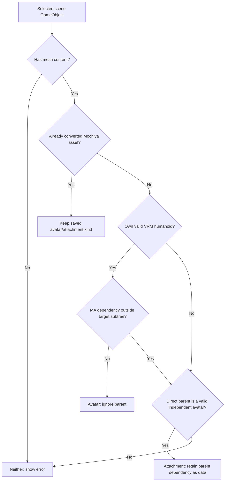

# Mochiya Avatar Tools

Prepare Unity avatars, outfits and accessories for [Mochiya](https://mochiya.org) and compatible web viewers. Mochiya Avatar Tools converts supported VRChat and Modular Avatar setups into **VRM 1.0 or GLB**, preserves supported lilToon materials, and can upload items directly from the Unity Editor.

Conversion works on a duplicate and leaves your original setup unchanged. Offline conversion and export do not require a Mochiya account.

## What you can do

- Convert an avatar or attachment into an editable VRM GameObject.
- Export a VRM or GLB without creating a permanent scene duplicate.
- Preserve supported expressions, physics and attachment instructions for web playback.
- Upload a model, cover, gallery and additional buyer files directly to Mochiya.
- Reuse export profiles for metadata and native UniVRM/UniGLTF settings.

## Installation

Requires **Unity 2022.3 or newer** and **UniVRM/UniGLTF 0.131.2 or newer**. Add these entries to the existing `dependencies` object in your project's `Packages/manifest.json`:

```json
"com.vrmc.gltf": "https://github.com/vrm-c/UniVRM.git?path=/Packages/UniGLTF#v0.131.2",
"com.vrmc.vrm": "https://github.com/vrm-c/UniVRM.git?path=/Packages/VRM10#v0.131.2",
"org.mochiya.avatar-tools": "https://github.com/mochiya-labs/unity-avatar-tools.git"
```

The example pins a verified UniVRM version. For a downloaded checkout, use **Window → Package Manager → Add package from disk** and select its `package.json`.

Install **VRChat SDK Avatars**, **Modular Avatar** and **lilToon 2.3.4 or newer** when your source asset uses them. These integrations are optional, but missing scripts or shaders on your asset need to be repaired before conversion.

## Your first conversion or export

1. Place your avatar or attachment prefab in a scene. If an attachment depends on a base avatar, keep it directly under that avatar with its original MA setup intact.
2. Open **Mochiya → Avatar Tools** and assign **Avatar or attachment**.
3. Check **Detected asset** and its explanation. Resolve any errors; expand **Compatibility warnings (optional)** to review unsupported behavior.
4. Choose **Convert to VRM GameObject** to keep an editable scene duplicate, or **Export VRM / GLB…** to save a model file.

Choose **VRM** for supported humanoid, expression and spring-bone behavior. Choose **GLB** for general glTF use; ordinary GLB does not carry the VRM runtime behavior. The separate **Mochiya → Export GLB or VRM with lilToon…** window also supports ordinary props as GLB.

You do not need to move the model to the scene origin. Export normalizes a temporary copy; scene conversion places the duplicate at the reference avatar's position and rotation.

### Export settings

The bundled profile works without entering metadata for every export. It uses the object's name, version `1.0`, author **Mochiya VRM Exporter**, sparse morph targets and no mesh freezing. Review the metadata before distributing your model.

Under **Export settings (optional)**, select a profile or choose **Create editable copy**. You can also use **Assets → Create → Mochiya → Export Profile**. Profiles contain metadata and native UniVRM/UniGLTF options. Enable **Use Attached Vrm Metadata** to reuse metadata from an existing VRM.

## Working with attachments


A parent alone does not make a target an attachment. The deciding factor is **dependency**:

Attachments include clothing, accessories, hair and other assets that depend on a base avatar. There is no separate Accessory category.

- **Avatar:** its own humanoid can be exported as VRM, and its MA setup has no dependency outside the selected subtree.
- **Attachment:** it needs its direct parent's humanoid, or MA components inside it reference/change the parent, its other descendants, or avatar settings. The direct parent must be a valid independent avatar.
- **Neither:** neither rule can be satisfied, or required authoring references are broken.

External dependencies include MA armature targets, Bone Proxies, blendshape sync/changes, object/material changes and avatar controller/settings references. Internal references do not create a parent dependency. An attachment with its own humanoid keeps it. Otherwise, conversion uses the attachment as the root and completes its existing armature with missing parent-reference humanoid bones. Matching authored bones keep their transforms, skin bindings and extra physics branches; there is no parallel reference armature or extra attachment wrapper. Parent and sibling meshes are excluded. An attachment without an owned rig receives the required reference bones.

Humanoid completion uses MA root targets and prefix/suffix settings, or unambiguous skin/hierarchy/name matching. Missing ancestors are inserted while preserving world poses. UniVRM's name-deduplication utility preserves mapped humanoid names first and renames conflicting objects in the duplicate; composition aliases retain original names. The resulting humanoid is rebuilt and validated; ambiguous mappings or incompatible hierarchies produce an error. External colliders retain their reference pose through explicit anchors when the garment has a different bone offset. This preparation is separate from MA baking: the exported component records still instruct Avatar Composition how the attachment follows a base.


```mermaid
flowchart TD
    A[Selected scene GameObject] --> B{Has mesh content?}
    B -- No --> X[Neither: show error]
    B -- Yes --> P{Already converted Mochiya asset?}
    P -- Yes --> K[Keep saved avatar/attachment kind]
    P -- No --> C{Own valid VRM humanoid?}
    C -- Yes --> D{MA dependency outside target subtree?}
    D -- No --> V[Avatar: ignore parent]
    D -- Yes --> E{Direct parent is a valid independent avatar?}
    C -- No --> E
    E -- Yes --> O[Attachment: retain parent dependency as data]
    E -- No --> X
```

The humanoid check uses the root Animator's valid Humanoid Avatar, required unique bone mappings and contained skin bones. An incomplete rig or a VRM/VRC component alone does not qualify. Broken MA references produce an error before classification. Prepared assets still undergo export validation.

Mochiya records supported MA instructions for web composition; it does not run MA baking. Selecting a whole avatar retains its included attachment rigs separately. Use Modular Avatar first when you need a Unity-side merge, or export the base and attachments separately for web composition.

## Upload directly to Mochiya

1. Open your [Mochiya profile](https://mochiya.org/profile), expand **API key** at the bottom, and copy your key.
2. Open **Mochiya → Upload to Mochiya**, paste the key and connect.
3. Select a scene avatar or attachment, complete the item details, and add a cover, optional gallery and additional buyer files.
4. Upload. The tool prepares and exports the model internally, then transfers the files.

Your key stays in memory; reconnect after restarting or reloading Unity. Keep it private. Regenerate it on the website to replace it, then reconnect Unity.

Raw MA/VRC setups are converted through the existing export workflow; prepared VRM GameObjects can be exported directly. Choose VRM or GLB and optionally select the shared export profile. VRM preserves supported VRM behavior; ordinary GLB does not carry the VRM spring runtime. See [supported behavior and limits](#supported-behavior-and-limits). Prefab assets must first be placed in the Hierarchy.

Enter the same item details as the website: title, category, tags, private/sale use and USD price, cover image, optional gallery, additional buyer files, specifications, requirements, credits and license text. The required model file is produced internally. Source objects remain unchanged. A temporary export is kept for retries and removed afterward.

Images must be PNG/JPEG up to 10 MiB each. Models and additional files are each at most 500 MiB, with a total of 2 GiB. Up to 12 gallery images and 20 additional files are supported. Private is the default. Paid sales need the website's seller setup. Additional files are explicitly selected; the tool does not package your project or dependencies automatically.

Uploads show preparation, file transfer and finalization. Retry skips completed files and restarts an interrupted file. Cancel stops the current transfer; the server expires and cleans unfinished uploads. After an editor reload, reconnect to recover a completed upload or finalize files that already arrived; if local preparation state was lost before all files arrived, start a fresh upload. Existing item edits are available through the website. A Unity preview is not a guarantee of identical browser rendering.

## Supported behavior and limits

**VRM** means `VRMC_vrm` unless another extension is named; **Mochiya** means `MOCHIYA_avatar_composition`.

| Output feature | Converted from | Main limitation |
| --- | --- | --- |
| VRM expressions | VRC visemes/eyelids; existing VRM expressions | VRC conversion covers five vowels and blink only. |
| VRM look-at | VRC eye rotations/View Position; existing VRM look-at | VRC eye ranges are approximated. |
| VRM first-person | Existing VRM settings or generated defaults | VRC-specific visibility is not translated. |
| Spring bones and colliders (`VRMC_springBone`) | VRC PhysBones/colliders; existing VRM physics | Approximate active-preset simulation and sphere/capsule collisions; no VRC interactions or angle limits. |
| Node constraints (`VRMC_node_constraint`) | Existing UniVRM constraints | No VRC constraint conversion. |
| Mochiya `mergeArmature` | MA Merge Armature; generated reference rig | Roots/settings are retained; web matching is unidirectional. Other lock modes warn and fall back. No Unity merge. |
| Mochiya `boneProxy` | MA Bone Proxy; external base-collider anchors | Keep World Pose or At Root in the web runtime; partial-pose/scale modes warn and keep world pose. |
| Mochiya `blendshapeSync` | MA Blendshape Sync | Grouped bindings with MA linear remap points; no synchronization chains or cycles. |
| Mochiya `shapeChanger` | MA Shape Changer | Preserves Set/Delete and distance threshold (`0.01` by default). The web runtime reversibly removes affected triangles. Exported morph frames or baked scale can change selection; export warns. Unavailable runtime geometry falls back to weight 0 with a warning. |
| Mochiya `objectToggle` | MA Object Toggle | Grouped visibility entries; no cyclic visibility rules. |
| Mochiya `materialSetter` | MA Material Setter | Grouped whole-material slot replacements. |
| Mochiya `menuItem` | MA Toggle/Button menu items | Automatic object activation and local parameter metadata; buttons are momentary. No Animator execution/networking/menu hierarchy. |
| lilToon materials (`MOCHIYA_materials_liltoon`) | Regular opaque/cutout/transparent lilToon, including outlines | No specialized variants; 2D textures/UV0 only. Browser appearance can differ. |

Component records preserve source roots, settings, conditions and grouped entries; resolved bone pairs are computed by the web runtime. The `@mochiya/avatar-composition` specification defines the wire format and runtime rules. Each VRM retains its own spring/collider groups; cross-asset collider linking is outside this profile.

Other VRC/MA behavior, including Animator programs, Contacts and mesh processing, is omitted. Ordinary GLB omits VRM behavior. Texture export requires graphics-enabled Unity.

## Use from a script

Put this in an Editor script. `selected` is a scene GameObject, `path` ends in `.vrm` or `.glb`, and `profile` is an optional export profile.

```csharp
using Mochiya.AvatarTools.Editor;

var detected = MochiyaAvatarWorkflow.Detect(selected);
var report = MochiyaAvatarWorkflow.Validate(selected);
if (!report.CanConvert)
    throw new System.InvalidOperationException(string.Join("\n", report.Errors));

// Direct conversion, export and temporary-object cleanup:
var exportReport = MochiyaAvatarWorkflow.Export(selected, path, profile);

// Or keep an editable duplicate in the scene:
var converted = MochiyaAvatarWorkflow.ConvertToVrmGameObject(selected, profile);
MochiyaLilToonExporter.ExportWithProfile(converted.Root, path, profile);
```

Omit the profile argument or pass `null` for the bundled default. Reports contain errors, warnings and unsupported features. The explicit `ConvertAvatarInScene` and `ConvertAttachmentInScene` APIs enforce the same classification rules. Dispose a conversion result only to remove its duplicate. Use `MochiyaLilToonExporter.ExportGlb(prop, path)` for a general model without a humanoid.

## Architecture and web playback

| Package | Responsibility |
| --- | --- |
| Modular Avatar | Authors attachment relationships and performs Unity-side merges when requested. |
| Mochiya Avatar Tools | Converts the selected asset, records supported MA intent, and adds Mochiya extensions during export. |
| UniVRM / UniGLTF | Provides standard VRM components, geometry/material conversion and VRM/GLB file writing. |
| `@pixiv/three-vrm` | Loads and updates standard VRM humanoids, expressions and spring bones in the browser. |
| [`three-liltoon`](https://github.com/mochiya-labs/three-liltoon) | Renders materials carrying `MOCHIYA_materials_liltoon`. |
| [`@mochiya/avatar-composition`](https://github.com/mochiya-labs/avatar-composition) | Reads `MOCHIYA_avatar_composition`, fits separate attachments by names, applies supported actions and restores the base on removal. |

The host enables rendering with `enableLilToon(renderer)` and registers `enableLilToonVRM(new VRMLoaderPlugin(parser))` plus `MochiyaAvatarCompositionLoaderPlugin` on one Three.js `GLTFLoader`. After loading, it prepares assets and attaches attachments through `AvatarCompositionSession`. Each frame: call `beforeVrmUpdate()`, update the base animation/VRM once, then call `afterVrmUpdate(delta)`. The [Avatar Composition example viewer](https://github.com/mochiya-labs/avatar-composition/tree/main/examples/viewer) demonstrates local-file loading, fitting, controls and removal.

Both Mochiya extensions are optional additions to standard files. Ordinary viewers display standalone geometry and fallback materials without attachment actions. Matching uses bone, armature, mesh and blendshape names; missing names warn and skip only affected operations. It does not check base identity or reshape garments to fit different bodies.

Both converted avatars and attachments carry `MOCHIYA_avatar_composition`, with `assetKind: "avatar"` or `"attachment"`. New attachment exports use `rig.role: "attachmentReference"`. The composition extension stores MA-style component instructions.

## License

Mochiya Avatar Tools is [MIT-licensed](LICENSE). UniVRM/UniGLTF (VRM Consortium) and lilToon (lilxyzw) are separate MIT-licensed projects whose source is not redistributed here. Models and textures retain their own licenses.
